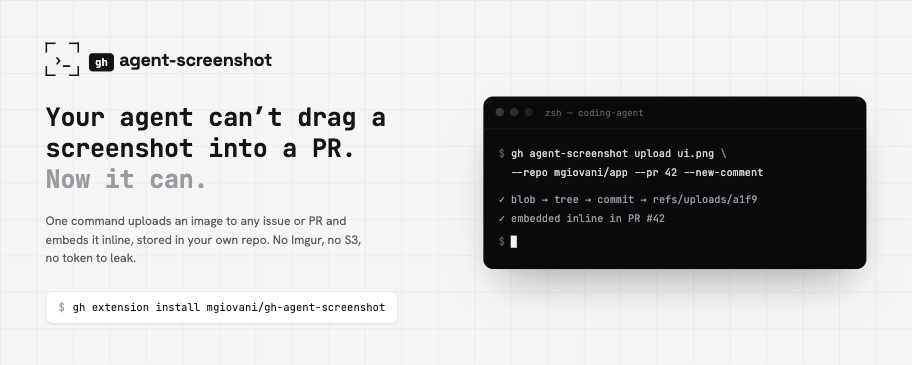

[](https://cli.github.com/manual/gh_extension)
[](LICENSE)
[](#supported-platforms)
[](Cargo.toml)

# gh-agent-screenshot

**Your agent can open a pull request but it cannot drag a screenshot into it. Now it can.**  




Your coding agent writes code, opens pull requests, and fixes bugs on its own. It still cannot do the one thing you do by reflex: drop a screenshot into a comment. GitHub only accepts images dragged into its web editor, and there is no public API for it. gh-agent-screenshot closes that gap. One command uploads an image to any issue or PR and embeds it inline, stored in your own repo through GitHub's Git Data API. No Imgur, no S3, no upload token to leak.

## Install

```sh
gh extension install mgiovani/gh-agent-screenshot
```

The extension auto-selects the matching prebuilt binary for your host OS and architecture from the latest GitHub Release.

## Supported Platforms

| Asset name                          | OS      | Arch  |
|-------------------------------------|---------|-------|
| `gh-agent-screenshot-darwin-amd64`        | macOS   | x86_64 |
| `gh-agent-screenshot-darwin-arm64`        | macOS   | Apple Silicon |
| `gh-agent-screenshot-linux-amd64`         | Linux   | x86_64 |
| `gh-agent-screenshot-linux-arm64`         | Linux   | aarch64 |
| `gh-agent-screenshot-windows-amd64.exe`   | Windows | x86_64 |

## Usage

### Upload images

```sh
# Print markdown image links only (default, no GitHub write)
gh agent-screenshot upload a.png b.png --repo owner/name --issue 1 --print-only

# Post images as a new comment
gh agent-screenshot upload a.png b.png --repo owner/name --issue 1 --new-comment

# Append images to an existing comment
gh agent-screenshot upload a.png b.png --repo owner/name --issue 1 --update-comment <id>

# Embed images in the issue/PR body
gh agent-screenshot upload a.png b.png --repo owner/name --pr 42 --edit-body
```

`--issue` and `--pr` are mutually exclusive; one is required. `--print-only` is the default write mode when no mode flag is given.

### Prune stale upload branches

```sh
# Preview which branches would be deleted (no writes)
gh agent-screenshot prune --repo owner/name --dry-run

# Delete branches older than the default threshold (90 days)
gh agent-screenshot prune --repo owner/name --confirm

# Delete branches older than a custom threshold
gh agent-screenshot prune --repo owner/name --confirm --older-than-days 30
```

`--dry-run` and `--confirm` are mutually exclusive. `--older-than-days` defaults to `90`.

## How It Works

Each upload creates a blob via the Git Data API, assembles a tree and commit, then pushes to a throwaway `refs/uploads/<id>` branch. The resulting comment embeds a `?raw=true` SHA-pinned URL that resolves directly to the blob content. Because the URL is under `raw.githubusercontent.com` and the repository is private, browsers authenticate the request via the logged-in GitHub session cookie: no token is exposed in the markdown, and the image renders inline for any collaborator who has repo access.

## Note on Private Repo Rendering

The private-repo inline render (image visible in a browser without a raw token) is verified by a logged-in browser session via cookie auth. CI cannot prove it automatically.

## Agent Skill

An agent skill is published so AI coding agents can learn how to use this extension:

```sh
gh skill install mgiovani/gh-agent-screenshot --all
```

The skill teaches agents all four write modes (`--print-only`, `--new-comment`, `--update-comment`, `--edit-body`) and the `prune` subcommand. See [`skills/gh-agent-screenshot/SKILL.md`](skills/gh-agent-screenshot/SKILL.md).

## Credits

Hero photo by [Xu Haiwei](https://unsplash.com/@mrsunburnt) on [Unsplash](https://unsplash.com/photos/black-and-white-robot-illustration-fv1EFjgIb94).

Licensed under the [MIT License](LICENSE).
